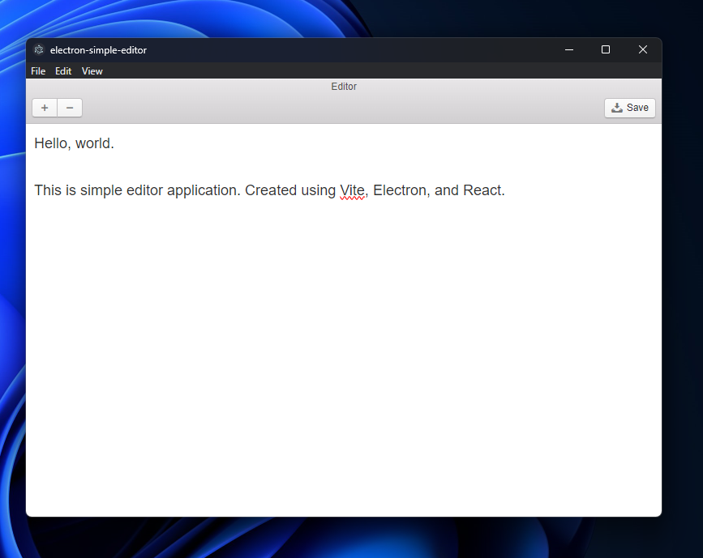

# electron-simple-editor

This project is a simple editor application, created using Vite, Electron, and React.



## Installation

```bash
npm install
```

## Usage

```bash
npm run dev
```

or

```bash
npm run build
```

then open the application for the platform it was built for.
